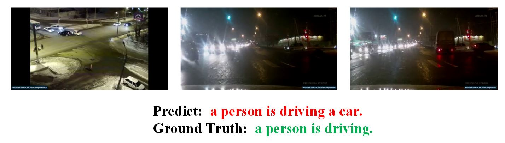
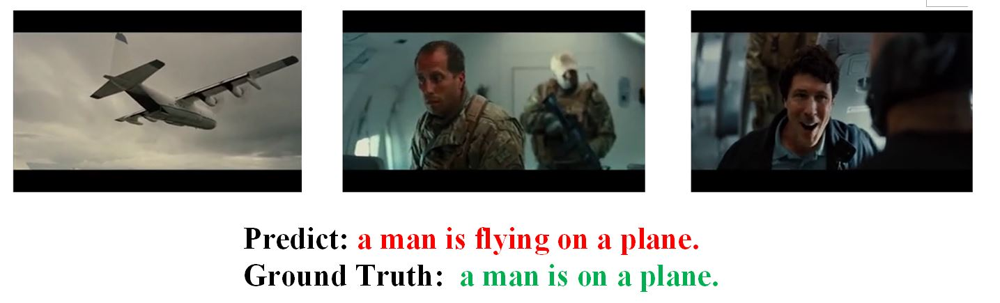

#  Multi-modal Feature Fusion Network for Video Captioning

## 1.Requirements

- Ubuntu 16.04

- CUDA 10.0

- Python 3.7

  - PyTorch 1.1

  - Torchvision 0.3.0

  - Tqdm

  - Keras 1.15.0

  - Tensorflow 2.4.1

  - Numpy

  - Pandas

  - Matplotlib
## 2.Dataset

We used the **MSVD** abd **MSR-VTT** Dataset to do our research.

### 2.1 MSVD

​	The **MSVD[1]** dataset is a collection of Youtube videos collected by Mechanical Turk. The dataset contains 1970 video clips, and each video clip is about 10 ~ 25 s.

​	You can download the dataset from <http://www.cs.utexas.edu/users/ml/clamp/videoDescription/>

### 2.2 MSR-VTT

​	The **MSR-VTT [2]** dataset is a large-scale dataset that contains 10,000 network video clips with a total duration of 41.2 hours, including 20 different types of videos, such as sports, music, games, and TV shows. Each video clip has 20 captions.

​	You can download the dataset from https://www.mediafire.com/folder/h14iarbs62e7p/shared

## 3.How to use

### 3.1  Install the python environment

First ,you need to install Anaconda first,which can be download from https://www.anaconda.com/.

```
$ conda create -n video_caption python==3.7
$ conda activate video_caption
$ cd project
$ pip install -r requirement.txt
```

### 3.2  Prepare Data

Take **MSR-VTT **as an example, after you downloaded this dataset,you can extract feature embeddings of the dataset.And if you want to quickly run this repository,you can just extract the 3D-CNN features of the dataset(because extracting all the features is time-consuming).

**Parser json to get the caption annotations**

```
$ cd dataset
# And modify the corresponding file path:jsonPath and saveJson
$ python ParserJson.py
```

**extract the i3d-features**

we use the i3d rerepository from https://github.com/piergiaj/pytorch-i3d/  

```
$ cd ../extra_features
$ And modify the corresponding file path:modelPath,saveRoot,videosRoot
$ python extract_features.py
```

Due to our limited video memory, we can only use feature extractors pretrained by others，and thanks for such an excellent work.

And if you want to extract other features,you can extract it in folder extra_features in a similar way.

### 3.3  Train

The structure of the data file before training is as follows:

|-- features
​	|-- 0001.npy
​	|-- 0002.npy
​		.....
​	|-- 1000.npy
|-- caption
​	|-- caption.json

And set the hyperparameters  in the config.py

```
$ cd ..
$ python train.py
```

For my result,I train the model for 150 epochs, and it cost about 8 hours.

### 3.4  Test

First set the hyperparameters  in the config.py

And test the video caption of the specified file.

```
$ python generateCaption.py.py -videoFeature feature_path --inputType feature
```

Then you can get the result like :

```
 The
==========================
 The man
==========================
 The man is
==========================
 The man is playing
==========================
 The man is playing the
==========================
 The man is playing the toys
```

## 4.Evaluation

We use the evaluation by coco caption from https://github.com/tylin/coco-caption

Comparison with other methods
**MSR-VTT**

| Method            | **BLEU** | **METEOR** | **ROUGE-L** | **CIDEr** |
| ----------------- | -------- | ---------- | ----------- | --------- |
| **MP-LSTM**       | 34.6     | 24.6       | -           | -         |
| **SA-LSTM**       | 36.3     | 25.5       | 58.3        | 39.9      |
| **STAT [3]**      | 37.4     | 26.6       | -           | 41.5      |
| **M3 [4]**        | 38.13    | 26.58      | -           | -         |
| **DenseLSTM [5]** | 38.1     | 26.6       | -           | 42.8      |
| **hLSTMat [6]**   | 38.3     | 26.3       | -           | -         |
| **GRU-EVE [7]**   | 38.3     | 28.4       | -           | 48.1      |
| **RecNet [8]**    | **39.1** | 26.6       | 59.3        | 42.7      |
| **Ours**          | 38.7     | **29.7**   | **61.1**    | **49.2**  |

## 5.Result

In order to better illustrate the results, I show some imagel results:






## Reference
**[1]Chen DL，Dolan W B. Collecting highly parallel data for paraphraseevaluation［C］//Meeting of the Association for Computational Linguistics. USA:ACM,2011:190-200.**
**[2] Xu J,Mei T,Yao T,et al. MSR-VTT： a large video description dataset for bridging video and language［C］//Computer Vision and Pattern Recognition. Las Vegas: IEEE,2016: 5288- 5296.**

**[3] Tu, Y., Zhang, X., Liu, B., Yan, C.: Video description with spatial-temporal attention. In: ACM MM (2017)**

**[4] Wang, J., Wang, W., Huang, Y., Wang, L., Tan, T.: M3: multimodal memory modelling for video captioning. In: CVPR (2018)**

**[5] Zhu, Y., Jiang, S.: Attention-based densely connected LSTM for video captioning. In: ACM MM (2019)**

**[6] Song, J., Gao, L., Guo, Z., Liu, W., Zhang, D., Shen, H.T.: Hierarchical LSTM with adjusted temporal attention for video captioning. In: IJCAI (2017)**

**[7] Aafaq, N., Akhtar, N., Liu, W., Gilani, S.Z., Mian, A.: Spatio-temporal dynamicsand semantic attribute enriched visual encoding for video captioning. In: CVPR (2019)**

**[8] Wang, B., Ma, L., Zhang, W., Liu, W.: Reconstruction network for video captioning. In: CVPR (2018)**